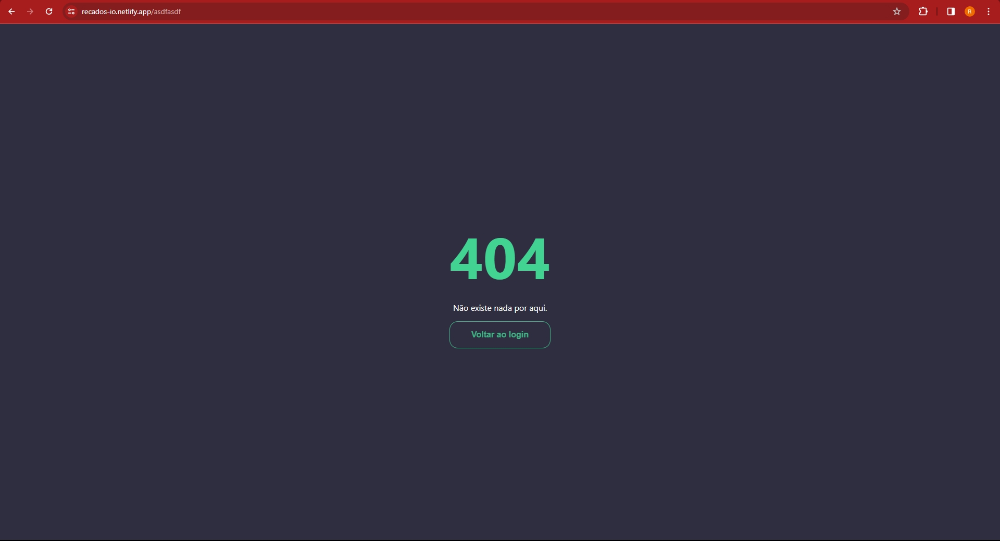

# Recados.IO - Aplicação

## Objetivo

Aplicação Web para publicar recados de acordo com o mural informado na tela de acesso. Essa aplicação deve permitir, aos usuários que acessam o mesmo mural, saber quando um usuário está adicionando um novo recado, via websocket, e atualizar o painel para todos os usuários que acessam o mesmo mural.

A aplicação está disponível em https://recados-io.netlify.app/

## Recursos adicionados

A lista de recursos (features) adicionados são:

- Adição de recados por mural;
- Adição de recados identificados ou anônimos;
- Notificação, aos outros usuários no mesmo canal, quando um usuário está deixando um novo recado;
- Correção do texto escrito por Inteligêincia artificial (Chat GPT);
- Exclusão de recados;
- Atualização, em tempo real via websocket, do mural para todos os usuários que o acessam;
- Exibe a quantidade de usuários conectados ao mural;
- Filtro de mensagens de acordo com sua importância.

## Arquitetura da aplicação

A arquitetura da aplicação consiste em:

- Frontend: Interface do usuário desenvolvida em VUE;
- Backend: Backend desenvolvido em Typescript e Node.JS;
- Banco de dados: Mongo DB, banco de dados não relacional usado para salvar as mensagens criadas no mural;
- Inteligência Artificial: Integração com a Open AI (Chat GPT) para a correção de mensagens enviadas;
- Integração com Websockets: Integração com a Pusher para comunicação, em tempo recal (websocket), entre os usuários.

## Tecnologias utilizadas

A lista de tecnologias utilizadas na aplicação consiste em:

### Frontend

- Vue: Framework para desenvolvimento de aplicação SPA no frontend;
- Vuex: Gerenciador de estados globais para aplicações em Vue;
- Typescript: Tipagem para o Javascript;
- Axios: Ferramenta para integração e execução de requisições no frontend;
- Sass: Pré-processador de CSS, para facilitar o desenvolvimento do CSS;
- Cypress: Testes end-to-end (e2e) para simular o uso da aplicação por usuários;
- Jest: Testes unitários.
- Moment: Conversor de datas;

### Backend

- Node.JS: Javascript para rodar em servidor;
- Express: Framework para desenvolvimento de aplicações REST API no Node.JS;
- Axios: Ferramenta para integração e execução de requisições no frontend;
- MongoDB: Banco de dados não relacional para salvamento das mensagens;

## Rotas da aplicação

A aplicação possui as seguintes rotas:

- Login: '/',
- Board: '/board/:boardName',
- 404: '/*'

## Telas da aplicação

- Login

- Mural

- 404

