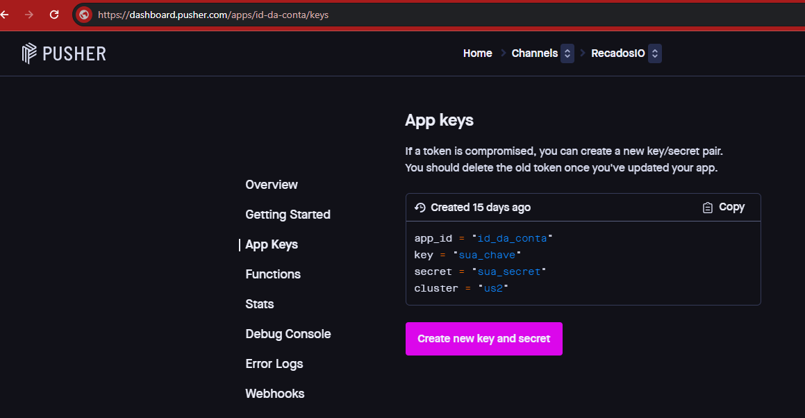
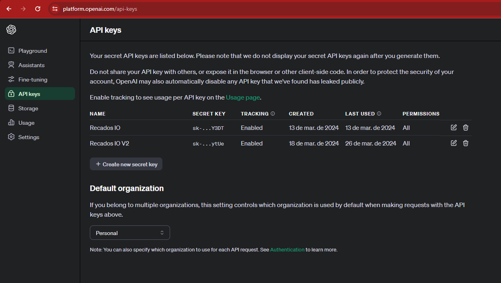

# Recados.IO - Backend

Backend da aplicação Recados.IO. Desenvolvido em Typescript e tecnologias relacionadas como Express, Mongo DB, etc.

## Setup do projeto

Rode o comando:

```
npm install
```

Crie um arquivo chamado .env.development com base no arquivo .env.example e configure as seguintes variáveis de ambiente da seguinte maneira:

- MONGO_DB_URL: Conexão com o Mongo DB Atlas, para armazenamento das mensagens salvas no mural. Para gerar essa conexão, visite https://www.mongodb.com/basics/mongodb-connection-string#:~:text=How%20to%20get%20your%20MongoDB,connection%20string%20for%20your%20cluster.

- PUSHER_CONNECTION_KEY (key): Conexão com o serviço Pusher, para comunicação em tempo real entre os usuários. Para gerar a chave(key) de acesso, visite a página https://pusher.com/docs/channels/getting_started/javascript-realtime-chart/?ref=use-case-quick-starts para ver como criar as chaves de acesso para o Pusher.

- PUSHER_CONNECTION_KEY (add_id): ID da conta dentro do Pusher.

- PUSHER_CONNECTION_SECRET (secret): Gerado em conjunto com a chave(key).



- OPEN_AI_KEY: Para gerar uma key da Open AI, visite https://platform.openai.com/docs/api-reference/authentication. Tenha em mente que a API da Open AI pode exigir pagamentos para habilitar a integração com sua API.



## Rodando o projeto

Depois das configurações execute o seguinte comando:

```
npm run dev
```

Esse comando irá iniciar o backend da aplicação no endereço http://localhost:8888

## Rotas disponíveis no backend

As rotas disponíveis no backend são:

- GET - '/' : "Hello world";

- POST - '/pusher/auth' : Autenticação no pusher, para acesso ao canal especificado;
Body:
```
{
    socket_id (string): Id de conexão do pusher,
    channel_name(string): Nome do canal que está se conectando
}
```

- GET - '/messages/all' : Retorna todas as mensagens salvas no banco de dados;

- POST - '/messages/all' : Retorna todas as mensagens de um canal específico;
Body:
```
{
  "channel": "Nome do canal começando com 'private-'",
  "type" (string): "Tipo da mensagem (important, not-important, urgent)",
}
```

- POST - '/messages/new' : Salva uma nova mensagem no banco de dados, de acordo com o canal especificado;
Body:
```
{
    "author" (string): "Autor da mensagem",
    "type" (string): "Tipo da mensagem (important, not-important, urgent)",
    "date" (string): "03-18-2024",
    "text" (string): "Texto para ser salvo",
    "channel" (string): "nome do canal começando com 'private-'"
}
```

- DELETE - '/messages/delete/:id': Apaga uma mensagem de acordo com o ID da mensagem.
