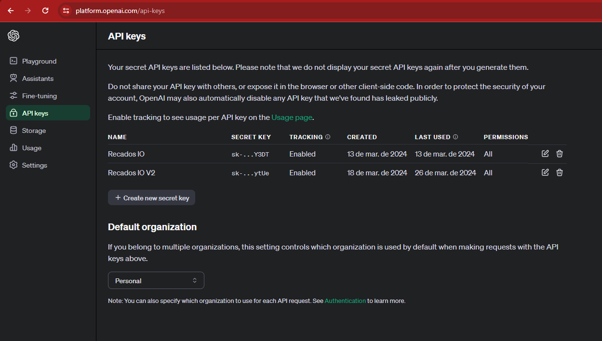

# Recados.IO - Frontend

Frontend da aplicação Recados.IO. Desenvolvido em VUE e tecnologias relacionadas como VUEX, Axios, etc.

## Setup do projeto

Rode o comando:

```
npm install
```

Crie um arquivo chamado .env.development com base no arquivo .env.example e configure as seguintes variáveis de ambiente da seguinte maneira:

- VUE_APP_OPEN_AI_KEY: Para gerar uma key da Open AI, visite https://platform.openai.com/docs/api-reference/authentication. Tenha em mente que a API da Open AI pode exigir pagamentos para habilitar a integração com sua API.



- VUE_APP_API: endereço do backend. Por padrão, configure como http://localhost:8888. O backend da aplicação será disponível neste endereço por padrão.

- BASE_URL: Endereço da aplicação. Por padrão, configure como http://localhost:8080. O frontend da aplicação será disponível neste endereço por padrão.

## Rodando o projeto

Depois das configurações execute o seguinte comando:

```
npm run serve
```

Esse comando irá iniciar o frontend da aplicação no endereço http://localhost:8080

## Rodando testes

### Testes unitários

```
npm run test:unit
```

### Testes e2e
```
npm run test:cypress
```

### Testes e2e no Windoes
```
npm run test:cypress-windows
```

Por padrão, os testes e2e estão sendo executados no ambiente http://localhost:8080. Tenha em mente que, para eles funcionarem, tanto o frontend quanto o backend devem estar sendo executados localmente.

## Compilando o projeto

```
npm run build
```